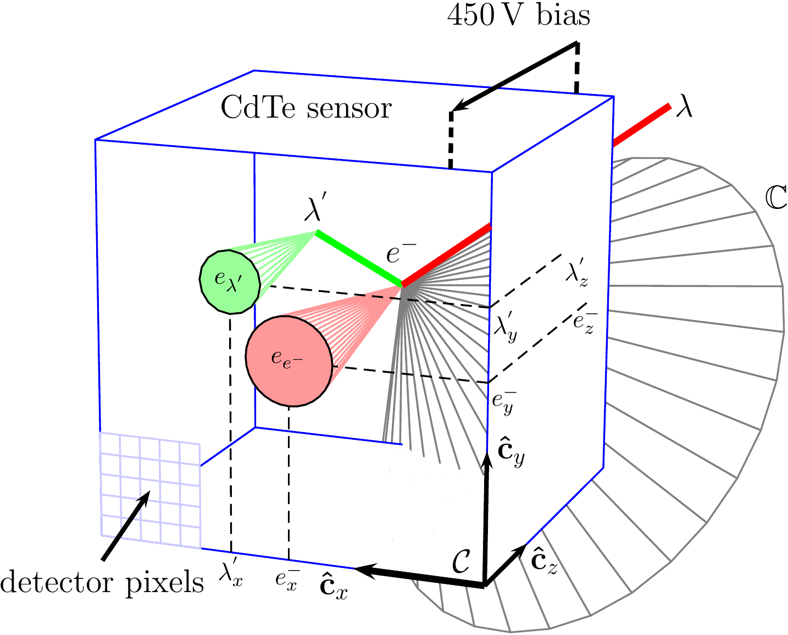
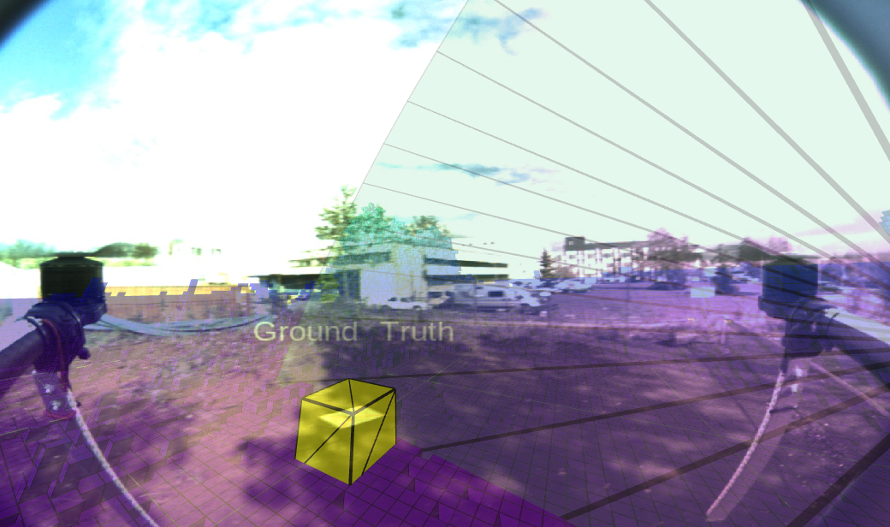

# compton_cone_generator

ROS package that consumes the stream of particle events from a single-detector Compton camera ([Rospix3](https://github.com/rospix/rospix3)) and reconstructs the Compton cones of possible directions to the radiation source.

<p align="center">
  
</p>

For every pair of coincident electron/photon clusters, the Compton scattering angle is reconstructed from the deposited energies and the sub-nanosecond arrival-time difference between the two events. Since Compton scattering is radially symmetric, the reconstructed direction to the source is not a single ray but a cone surface in 3D.

<p align="center">
  
</p>

## System overview

`compton_cone_generator` is the middle layer of a three-package pipeline for real-time gamma radiation source localization from a single-detector Compton camera:

1. [**Rospix3**](https://github.com/rospix/rospix3) — drives the MiniPIX TPX3 detector and publishes the stream of detected particle clusters (`rad_msgs/ClusterList`).
2. **compton_cone_generator** (this package) — subscribes to the cluster stream, pairs coincident events, and publishes the reconstructed Compton cones (`rad_msgs/Cone`).
3. [**compton_camera_filter**](https://github.com/rospix/compton_camera_filter) — fuses the incoming stream of cones into a real-time full-state hypothesis of the radiation source position.

## How it works

The main logic lives in the `ComptonConeGenerator` nodelet ([src/compton_cone_generator.cpp](./src/compton_cone_generator.cpp)), triggered once per incoming `rad_msgs/ClusterList` (`callbackClusterList`):

1. **Sort** — every `rad_msgs::Cluster` in the message is wrapped as a `SingleEvent` and the whole batch is sorted, either by time-of-arrival or by the detector's own event ID, depending on `coincidence_matching/method`.
2. **Coincidence matching** — the sorted list is swept looking for clusters whose time difference falls within the `detector/time_constant` coincidence window (~86 ns for the 2 mm CdTe sensor at 450 V). Exactly two clustered events in a window are treated as a valid electron/photon pair; one alone is discarded as noise, and more than two is logged as an ambiguous coincidence and skipped.
3. **Electron/photon assignment & gating** — the sign of the time difference picks which cluster is the electron and which is the scattered photon (with `generate_cones_from_both_sides`, both orderings are tried and can yield two cones). A pair is rejected if its two cluster centroids are closer than `min_pixel_distance/distance` pixels, or its summed/edge energies fall outside the configured `prior/*` bounds.
4. **Cone reconstruction** — the depth (z) separation between the two absorption points is derived from their time difference (`Δt / time_constant * sensor_thickness`) and combined with their pixel-plane offset (scaled by `pixel_pitch`) into a 3D direction vector in the camera frame. The Compton scattering angle θ is computed in `getComptonAngle()` from the two deposited energies via the inverted Compton formula; if θ > 90° the cone is flipped to keep an acute opening angle.
5. **Publish** — the resulting `rad_msgs::Cone` (origin, direction, half-angle θ) is transformed from the camera/body frame into `world_frame` (via `mrs_lib::Transformer`, using the drone's live GPS/TF as needed) and published on `cones_out`; the matched pair is republished on `coincidences_out`, and the cone plus its axis ray are pushed to RViz through `mrs_lib::BatchVisualizer`.

[src/cone_aggregator.cpp](./src/cone_aggregator.cpp) provides a companion `ConeAggregator` nodelet for multi-robot setups: it subscribes to the `cones_out` topic of every teammate listed in `network/robot_names`, transforms each incoming cone into a common `target_frame`, and republishes the merged stream — used to fuse cones detected by multiple UAVs into a single [compton_camera_filter](https://github.com/rospix/compton_camera_filter) instance.

## Dependencies

* [mrs_lib](https://github.com/ctu-mrs/mrs_lib)
  * [mrs_msgs](https://github.com/ctu-mrs/mrs_msgs)
* [rad_msgs](https://github.com/rospix/rad_msgs)
* [rad_utils](https://github.com/rospix/rad_utils)

## Citing this work

If you use this package in your research, please cite the following papers:

```bibtex
@inproceedings{baca2019timepix,
  author    = {Baca, Tomas and Jilek, Martin and Manek, Pavel and others},
  title     = {{Timepix Radiation Detector for Autonomous Radiation Localization and Mapping by Micro Unmanned Vehicles}},
  booktitle = {2019 IEEE/RSJ International Conference on Intelligent Robots and Systems (IROS)},
  year      = {2019},
  publisher = {IEEE},
  pages     = {1--8},
}

@inproceedings{baca2021gamma,
  author    = {Baca, Tomas and Stibinger, Petr and Doubravova, Daniela and Turecek, Daniel and Solc, Jaroslav and Rusnak, Jan and Saska, Martin and Jakubek, Jan},
  title     = {{Gamma Radiation Source Localization for Micro Aerial Vehicles with a Miniature Single-Detector Compton Event Camera}},
  booktitle = {2021 International Conference on Unmanned Aircraft Systems (ICUAS)},
  year      = {2021},
  publisher = {IEEE},
}

@article{stibinger2020localization,
  author  = {Stibinger, Petr and Baca, Tomas and Saska, Martin},
  title   = {{Localization of Ionizing Radiation Sources by Cooperating Micro Aerial Vehicles With Pixel Detectors in Real-Time}},
  journal = {IEEE Robotics and Automation Letters},
  volume  = {5},
  number  = {2},
  pages   = {3634--3641},
  year    = {2020},
  doi     = {10.1109/LRA.2020.2978456},
}
```
